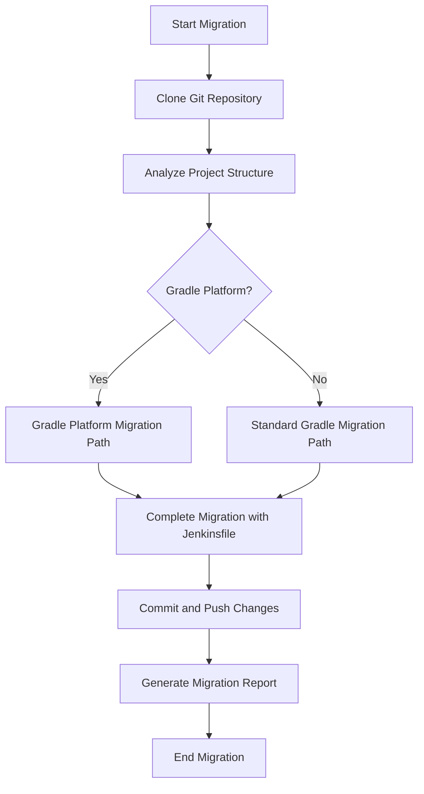
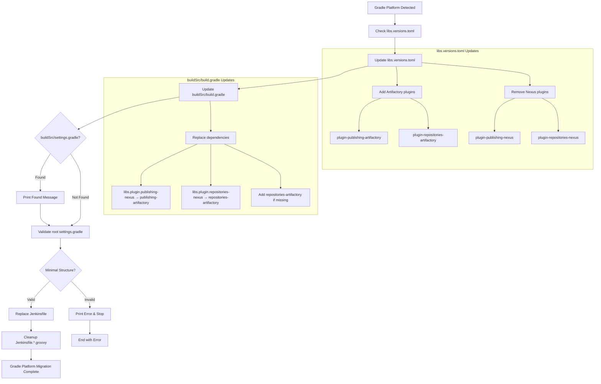
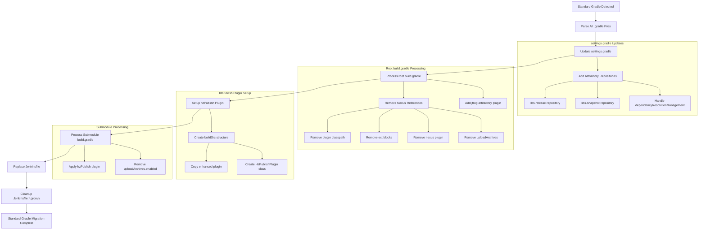

# Gradle Nexus to Artifactory Migration - Complete Workflow Flowchart

## High-Level Flow



## Detailed Workflow Flowcharts

### Gradle Platform Migration Path



### Standard Gradle Migration Path



## Detailed Step Descriptions

### 1. Project Analysis (Common to Both Paths)
- **Find all .gradle files**: Recursively search for `*.gradle` and `*.gradle.kts` files
- **Detect Gradle Platform**: Check for `gradle/libs.versions.toml` and `plasmaGradlePlugins`
- **Analyze build files**: Identify Nexus references and current configuration

### 2. Gradle Platform Migration Steps

#### libs.versions.toml Updates
```toml
# ADD these under [libraries]
plugin-publishing-artifactory = { module = "ops.plasma.publishing-artifactory:ops.plasma.publishing-artifactory.gradle.plugin", versions.ref = "plasmaGradlePlugins" }
plugin-repositories-artifactory = { module = "ops.plasma.repositories-artifactory:ops.plasma.repositories-artifactory.gradle.plugin", versions.ref = "plasmaGradlePlugins" }

# REMOVE these under [libraries]
plugin-publishing-nexus = { module = "ops.plasma.publishing-nexus:ops.plasma.publishing-nexus.gradle.plugin", versions.ref = "plasmaGradlePlugins" }
plugin-repositories-nexus = { module = "ops.plasma.repositories-nexus:ops.plasma.repositories-nexus.gradle.plugin", versions.ref = "plasmaGradlePlugins" }
```

#### buildSrc/build.gradle Updates
```gradle
// REPLACE these dependencies
implementation libs.plugin.publishing-nexus → implementation libs.plugin.publishing-artifactory
implementation libs.plugin.repositories-nexus → implementation libs.plugin.repositories-artifactory

// ADD if repositories-nexus was missing
implementation libs.plugin.repositories-artifactory
```

#### Root settings.gradle Validation
**Required minimal structure**:
```gradle
rootProject.name = 'repo_name'
include 'module1_name'
include 'module2_name'
```

### 3. Standard Gradle Migration Steps

#### settings.gradle Repository Configuration
```gradle
repositories {
    maven {
        url = 'https://artifactory.org.com/artifactory/libs-release'
        credentials {
            username = project.findProperty("artifactory_user") ?: System.getProperty("gradle.wrapperUser")
            password = project.findProperty("artifactory_password") ?: System.getProperty("gradle.wrapperPassword")
        }
        authentication {
            basic(BasicAuthentication)
        }
    }
    maven {
        url = 'https://artifactory.org.com/artifactory/libs-snapshot'
        // Similar configuration...
    }
}
```

#### Nexus Removal from Root build.gradle
**Remove**:
- `classpath "com.bmuschko:gradle-nexus-plugin:2.3.1"`
- `def nexusCredentialsLocation = System.properties['user.home'] + "/.secure/nexus.credentials"`
- `ext` blocks with Nexus variables
- `apply plugin: "com.bmuschko.nexus"`
- `nexus` configuration blocks
- `wrapper` blocks with Nexus distribution URLs
- `uploadArchives.enabled = false`

**Add**:
```gradle
plugins {
    id 'com.jfrog.artifactory' version '4.28.2'
}
```

#### hzPublish Plugin Setup
```
buildSrc/
├── build.gradle
└── src/main/groovy/
    ├── hzPublish.gradle (copied from enhanced template)
    └── HzPublishPlugin.groovy
```

#### Submodule build.gradle Updates
```gradle
plugins {
    id 'hzPublish'
}

// Remove: uploadArchives.enabled = true
```

### 4. Common Final Steps (Both Paths)

#### Jenkinsfile Replacement
- Replace existing `Jenkinsfile` with template from `templates/Jenkinsfile.enhanced`
- Backup original Jenkinsfile to `Jenkinsfile.jenkinsfile.backup`

#### Jenkinsfile Cleanup
- Delete all `Jenkinsfile.*.groovy` files (e.g., `Jenkinsfile.build.groovy`, `Jenkinsfile.seed.groovy`)

## Error Handling

### Gradle Platform Errors
- **Invalid libs.versions.toml**: Stop migration, report error
- **Non-minimal settings.gradle**: Print content, report error
- **Missing buildSrc/build.gradle**: Report error

### Standard Gradle Errors
- **Missing settings.gradle**: Create with Artifactory repositories
- **Missing root build.gradle**: Report error
- **hzPublish setup failure**: Report error, continue with partial migration

### Common Errors
- **Git clone failure**: Report error, skip repository
- **Jenkinsfile template missing**: Report error, continue migration
- **Jenkinsfile cleanup failure**: Report error, continue migration

## Success Criteria

### Gradle Platform Success
✅ libs.versions.toml updated with Artifactory plugins  
✅ Nexus plugins removed from libs.versions.toml  
✅ buildSrc/build.gradle dependencies updated  
✅ Root settings.gradle has minimal structure  
✅ Jenkinsfile replaced successfully  
✅ Jenkinsfile.*.groovy files cleaned up  

### Standard Gradle Success  
✅ settings.gradle updated with Artifactory repositories  
✅ Nexus references removed from root build.gradle  
✅ jfrog.artifactory plugin added to root build.gradle  
✅ hzPublish plugin set up in buildSrc  
✅ hzPublish plugin applied to submodule build.gradle files  
✅ Jenkinsfile replaced successfully  
✅ Jenkinsfile.*.groovy files cleaned up  

## Parallel Processing

The workflow supports parallel processing of multiple repositories:
- Uses `ThreadPoolExecutor` for concurrent migrations
- Configurable number of workers (default: 10, max: 30)
- Individual repository success/failure tracking
- Comprehensive migration reports with detailed results