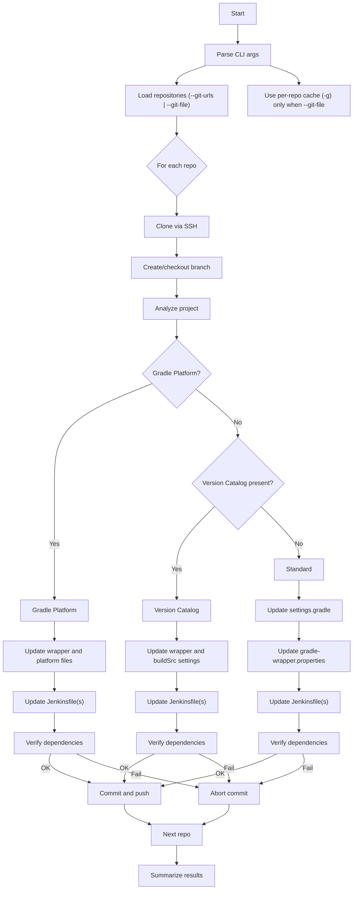

```mermaid
flowchart TD
    A[Start] --> B[Parse CLI args]
    B --> C["Load repositories (--git-urls | --git-file)"]
    C --> D{For each repo}
    D --> E[Clone via SSH]
    E --> F["Create/checkout branch"]
    F --> G[Analyze project]
    G --> H{Gradle Platform?}
    H -->|Yes| I[Gradle Platform]
    H -->|No| Q{Version Catalog present?}
    Q -->|Yes| R[Version Catalog]
    Q -->|No| J[Standard]

    %% Standard (High Level)
    J --> K[Update settings.gradle]
    K --> L[Update gradle-wrapper.properties]
    L --> JF["Update Jenkinsfile(s)"]
    JF --> S[Verify dependencies]
    S -->|OK| M[Commit and push]
    S -->|Fail| N[Abort commit]

    %% Gradle Platform (High Level)
    I --> I1[Update wrapper and platform files]
    I1 --> IJF["Update Jenkinsfile(s)"]
    IJF --> I2[Verify dependencies]
    I2 -->|OK| M
    I2 -->|Fail| N

    %% Version Catalog (High Level)
    R --> R1[Update wrapper and buildSrc settings]
    R1 --> RJF["Update Jenkinsfile(s)"]
    RJF --> R2[Verify dependencies]
    R2 -->|OK| M
    R2 -->|Fail| N

    %% Multi-repo cache isolation
    B --> B1["Use per-repo cache (-g) only when --git-file"]

    M --> O[Next repo]
    N --> O
    O --> P[Summarize results]
```
